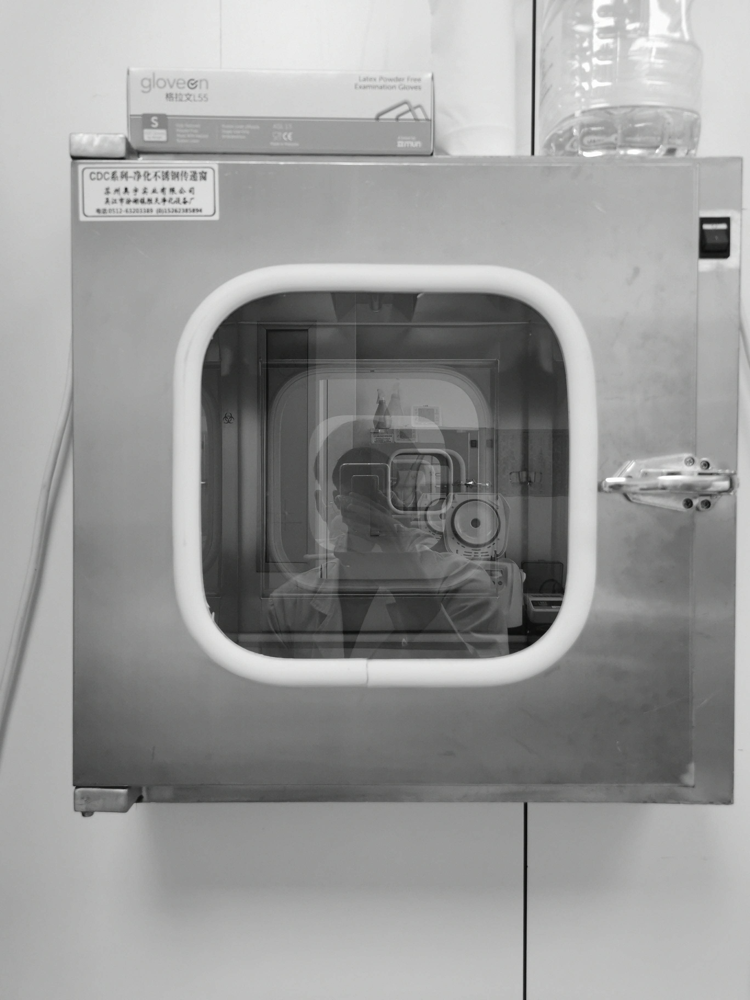

### This is Ryan

  
  

  

<b>Ryans in the LAB</b>

# Abilities and Interests
\ I am interested in Health Science and Statistics.

\ Majored in laboratory medicine in my undergraduate school, and now in the Mailman School of Public Health, MS/TM track.

\ Have some work experience with analyzing real life medical care data, using Python and R. 

_Here is my github page _
_[repo](https://github.com/MefiMefi)_

# Background
\ I came from China and for some reason I am still in China now.

\ I like music (especially classical music and rap), video games (now playing FFXIV) and I can draw something.

\ By the way, I just went to Disney last day :